# Thực hiện chức năng thanh toán đơn giản với JS + Google Sheet(Casso, AppScript) + Vietqr

Hướng dẫn thực hiện đơn giản chức năng chuyển khoản ngân hàng và kiểm tra thanh toán đã hoàn thành thông qua Google Sheet và Javascript thuần

## Ứng dụng

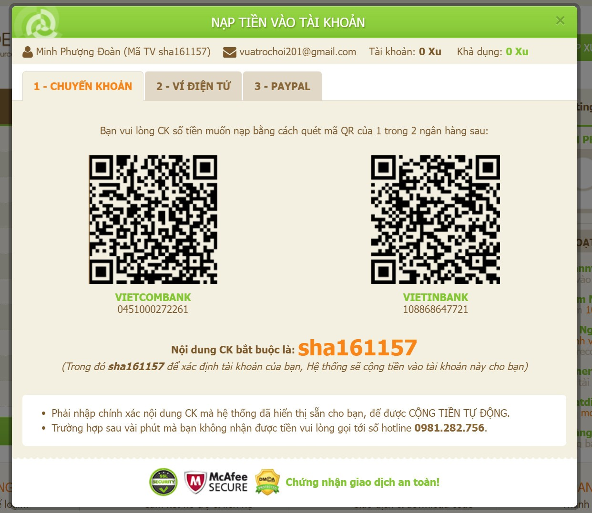
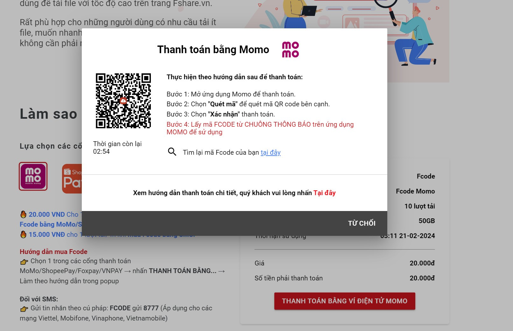

## Khởi tạo dự án

Bắt đầu với file `index.html` demo các trang web bán hàng online với mong muốn dữ liệu động của bản thân

[File tham khảo HTML](https://codepen.io/mfg888/pen/rNdYVMK)

```html
<!DOCTYPE html>
<html lang="en">
  <head>
    <meta charset="UTF-8" />
    <meta name="viewport" content="width=device-width, initial-scale=1.0" />
    <title>Payment use QR and Google Sheet</title>
  </head>
  <body>
    <section
      class="w-fit mx-auto grid grid-cols-1 lg:grid-cols-3 md:grid-cols-2 justify-items-center justify-center gap-y-20 gap-x-14 mt-10 mb-5"
      id="product-card"
    ></section>
    <script src="https://cdn.tailwindcss.com"></script>
    <script src="index.js"></script>
  </body>
</html>
```

Tạo file `index.js` sử dụng `DOMContentLoaded` chờ cho HTML load xong để tiến hành load dữ liệu lên DOM

```js
document.addEventListener('DOMContentLoaded', (event) => {
  console.log('DOM fully loaded and parsed');
});
```

Khai báo danh sách sản phẩm

```js
const products = [
  {
    image:
      'https://images.unsplash.com/photo-1646753522408-077ef9839300?ixlib=rb-1.2.1&ixid=MnwxMjA3fDB8MHxwcm9maWxlLXBhZ2V8NjZ8fHxlbnwwfHx8fA%3D%3D&auto=format&fit=crop&w=500&q=60',
    name: 'Pepsi',
    price: 6000,
    codeproduct: 'PepsiVN',
  },
  {
    image:
      'https://images.unsplash.com/photo-1651950519238-15835722f8bb?ixlib=rb-1.2.1&ixid=MnwxMjA3fDB8MHxwcm9maWxlLXBhZ2V8Mjh8fHxlbnwwfHx8fA%3D%3D&auto=format&fit=crop&w=500&q=60',
    name: 'Cocacola',
    price: 6500,
    codeproduct: 'CocacolaVN',
  },
  {
    image:
      'https://images.unsplash.com/photo-1651950537598-373e4358d320?ixlib=rb-1.2.1&ixid=MnwxMjA3fDB8MHxwcm9maWxlLXBhZ2V8MjV8fHxlbnwwfHx8fA%3D%3D&auto=format&fit=crop&w=500&q=60',
    name: 'Fanta',
    price: 6999,
    codeproduct: 'FantaVN',
  },
];
```

Tiến hành query DOM root `product-card` và load HTML

```js
const rootProductCard = document.querySelector('#product-card');
let htmlProdcut = '';
```

Loop tạo HTML

```js
products.forEach(
  (product) =>
    (htmlProdcut += `
   <div
   class="w-72 bg-white shadow-md rounded-xl duration-500 hover:scale-105 hover:shadow-xl"
 >
   
   <div class="px-4 py-3 w-72">
     <span class="text-gray-400 mr-3 uppercase text-xs">Brand</span>
     <p class="text-lg font-bold text-black truncate block capitalize">
       ${product.name}
     </p>
     <div class="flex items-center">
       <p class="text-lg font-semibold text-black cursor-auto my-3">
         ${product.price}
       </p>
       <del>
         <p class="text-sm text-gray-600 cursor-auto ml-2">50000</p>
       </del>
       <div class="ml-auto">
         <svg
           xmlns="http://www.w3.org/2000/svg"
           width="20"
           height="20"
           fill="currentColor"
           class="bi bi-bag-plus"
           viewBox="0 0 16 16"
         >
           <path
             fill-rule="evenodd"
             d="M8 7.5a.5.5 0 0 1 .5.5v1.5H10a.5.5 0 0 1 0 1H8.5V12a.5.5 0 0 1-1 0v-1.5H6a.5.5 0 0 1 0-1h1.5V8a.5.5 0 0 1 .5-.5z"
           />
           <path
             d="M8 1a2.5 2.5 0 0 1 2.5 2.5V4h-5v-.5A2.5 2.5 0 0 1 8 1zm3.5 3v-.5a3.5 3.5 0 1 0-7 0V4H1v10a2 2 0 0 0 2 2h10a2 2 0 0 0 2-2V4h-3.5zM2 5h12v9a1 1 0 0 1-1 1H3a1 1 0 0 1-1-1V5z"
           />
         </svg>
       </div>
     </div>
   </div>
 </div>

   `)
);
```

Inner HTML ra screen

```js
rootProductCard.innerHTML = htmlProdcut;
```

Kết quả thu được

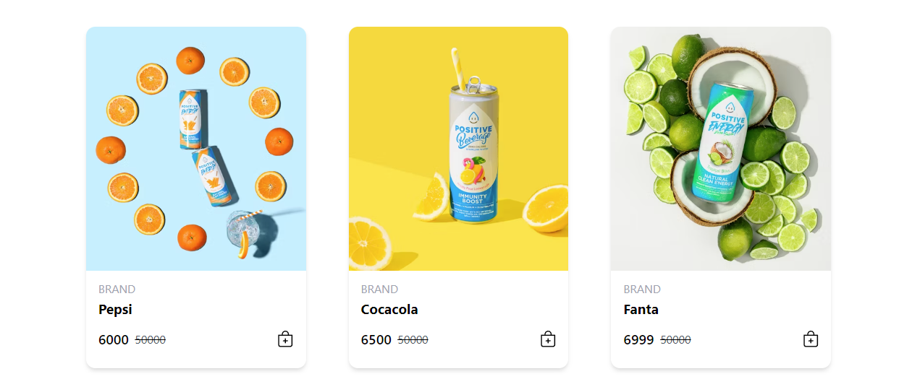

## Tiến hành tạo mã QR và đưa vào trang web

Bây giờ chúng ta bắt đầu tạo mã QR để thanh toán nhanh với [vietqr](https://vietqr.io/danh-sach-api/link-tao-ma-nhanh/)

- Giao diện tổng quan
  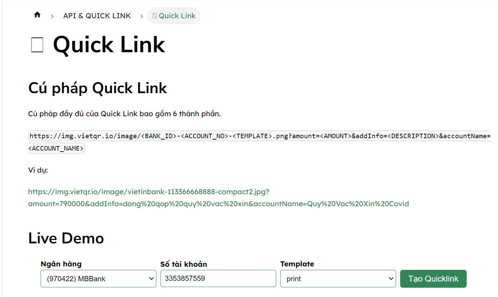

Chúng ta tiến hành tạo mã QR để thanh toán nhanh và bấm tạo `quicklink` để preview mã đó

<!-- Demo -->
<!--  -->

Sau khi có mã QR, chúng ta bắt đầu đưa vào trang web của chúng ta

`index.html` khởi tạo thẻ `img` với src ta vừa tạo xong

```html
<div class="flex justify-center w-50">
  
</div>
```

Kết quả thu được 🎉🎉🎉
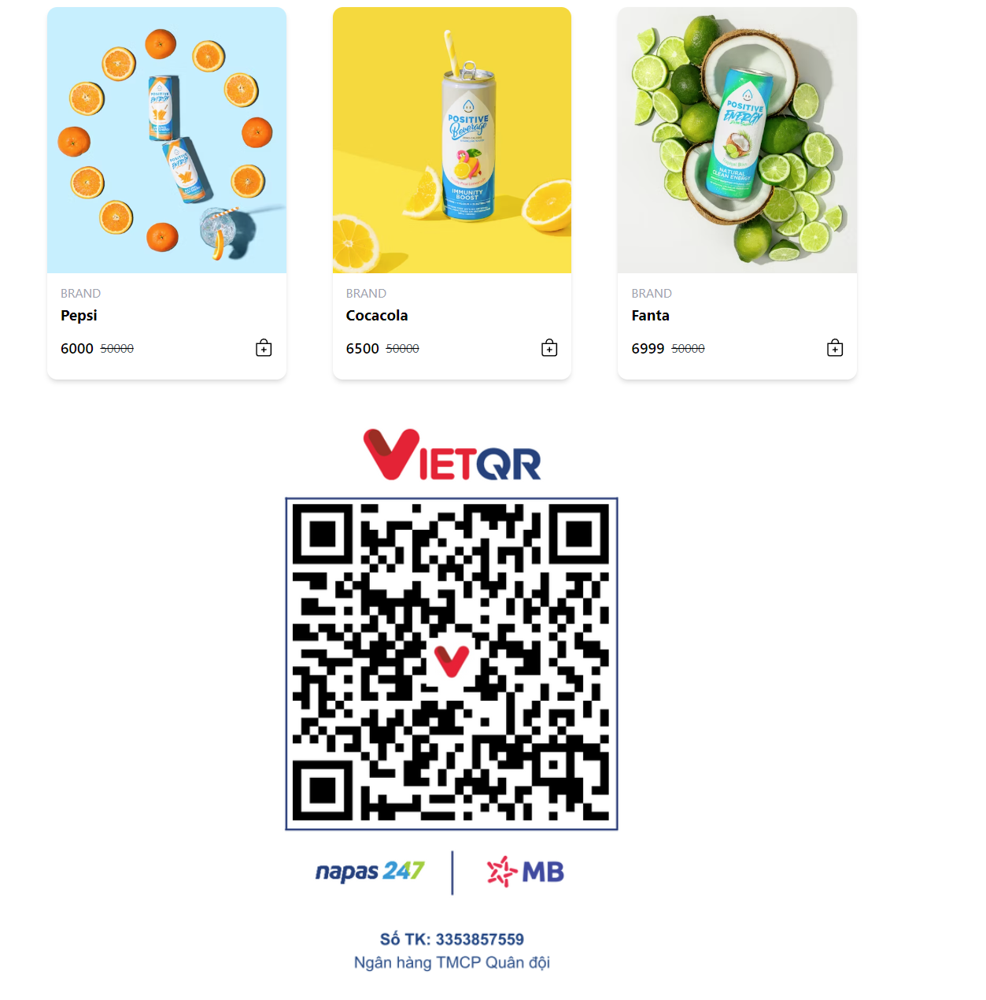

### Có vẻ khá là okie rồi, bây giờ chúng ta tiến hành chức năng khi click vào giỏ hàng, thì mã QR thay đổi theo

Đầu tiên ta xử lý sự kiện click cho giỏ hàng

Thêm class `button-payment` trong phần render HTML products

```html
<div class="ml-auto button-payment">
  <svg
    xmlns="http://www.w3.org/2000/svg"
    width="20"
    height="20"
    fill="currentColor"
    class="bi bi-bag-plus"
    viewBox="0 0 16 16"
  >
    <path
      fill-rule="evenodd"
      d="M8 7.5a.5.5 0 0 1 .5.5v1.5H10a.5.5 0 0 1 0 1H8.5V12a.5.5 0 0 1-1 0v-1.5H6a.5.5 0 0 1 0-1h1.5V8a.5.5 0 0 1 .5-.5z"
    />
    <path
      d="M8 1a2.5 2.5 0 0 1 2.5 2.5V4h-5v-.5A2.5 2.5 0 0 1 8 1zm3.5 3v-.5a3.5 3.5 0 1 0-7 0V4H1v10a2 2 0 0 0 2 2h10a2 2 0 0 0 2-2V4h-3.5zM2 5h12v9a1 1 0 0 1-1 1H3a1 1 0 0 1-1-1V5z"
    />
  </svg>
</div>
```

Xử lý sự kiện click

```js
const btnPayments = document.querySelectorAll('.button-payment');
currentButton.addEventListener('click', async () => {
  const productInfo = products[index];
  console.log(productInfo);
});
```

Kết quả 😊
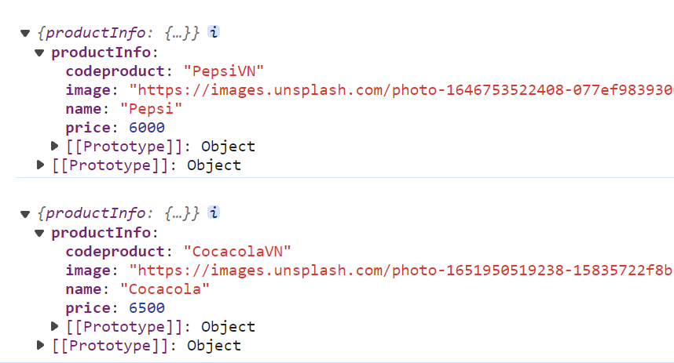

Tiếp theo tiên hành thay đổi nội dung DOM img

```js
currentButton.addEventListener('click', async () => {
  const productInfo = products[index];
  const userID = 'PhuongDoan';
  const productInfoPrice = productInfo.price;
  const productInfoCode = productInfo.codeproduct;
  const QRBankLink = `https://img.vietqr.io/image/MBBank-3353857559-print.jpg?amount=${productInfoPrice}&addInfo=${productInfoCode}${userID}`;
  document.getElementById('qrcode').src = QRBankLink;
```

Kết quả: Nội dung mã QR đã thay đổi
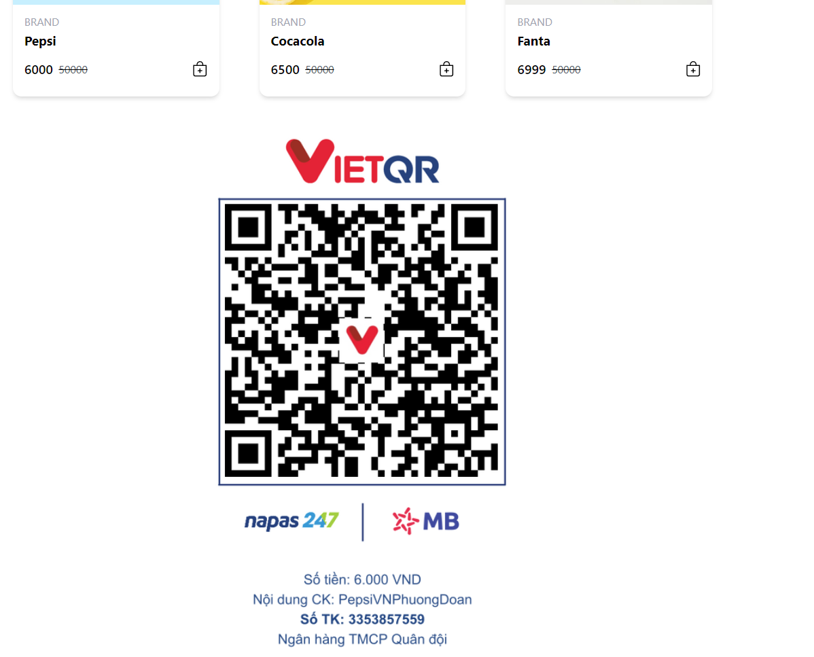
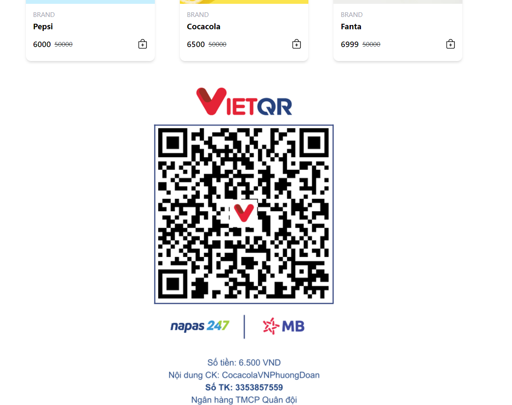

- Chú thích:
- Ở đây ta thêm `userID` để làm unique cho các mã giao dịch

```
Cú pháp đầy đủ của Quick Link bao gồm 6 thành phần.

https://img.vietqr.io/image/<BANK_ID>-<ACCOUNT_NO>-<TEMPLATE>.png?amount=<AMOUNT>&addInfo=<DESCRIPTION>&accountName=<ACCOUNT_NAME>

Ví dụ:

https://img.vietqr.io/image/vietinbank-113366668888-compact2.jpg?amount=790000&addInfo=dong%20qop%20quy%20vac%20xin&accountName=Quy%20Vac%20Xin%20Covid
```

## Sử dụng bot [Casso](https://casso.vn/) để quản lý thanh toán

Casso giúp doanh nghiệp tập trung hóa dữ liệu tài chính và tự động hóa các tác vụ liên quan tới dòng tiền: thanh toán - vận hành - tài chính - thuế - kế toán

1. Tiến hành đằng kí: Sử dụng Gmail của Google

2. Tiến hành tạo tài khoản doanh nghiệp
   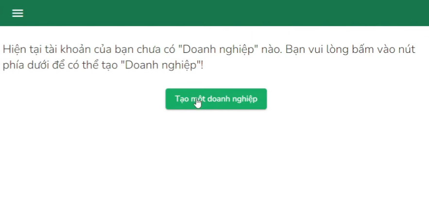
3. Tạo doanh nghiệp Demo


4. Tiến thành thêm ngân hàng -> ở đây mình dùng MBBank (Ở phần tích hợp Email, tạm thời ẩn đi ) -> Chọn thêm tích hợp -> Google Sheet -> Chọn ngân hàng và chọn loại giao dịch: Tiền vào
   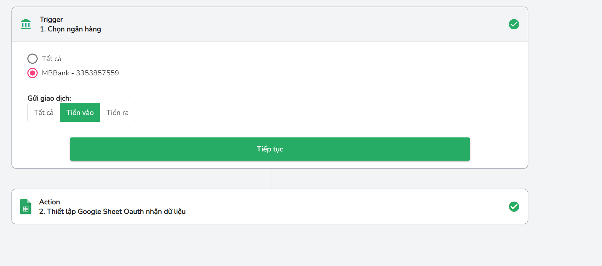

[Chi phí](https://my.casso.vn/business/7665/usage-and-billing/plans)

5. Trong phần thiết lập, Tạo file Google Sheet -> CHọn Đúng `Bảng tính` và `Tên trang tính:` (Bắt buộc)
   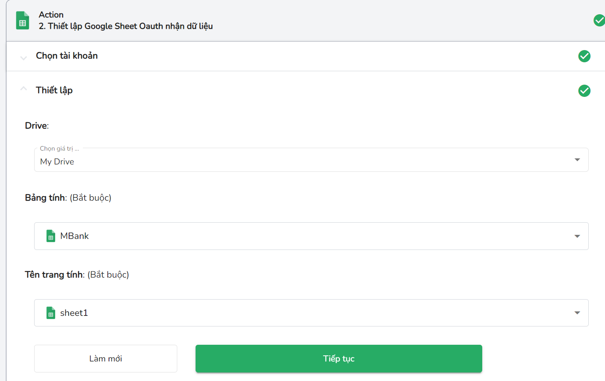

6. Cấu hình dữ liệu, phần `Vị trí bản ghi mới` chọn `Cuối bảng tính`
   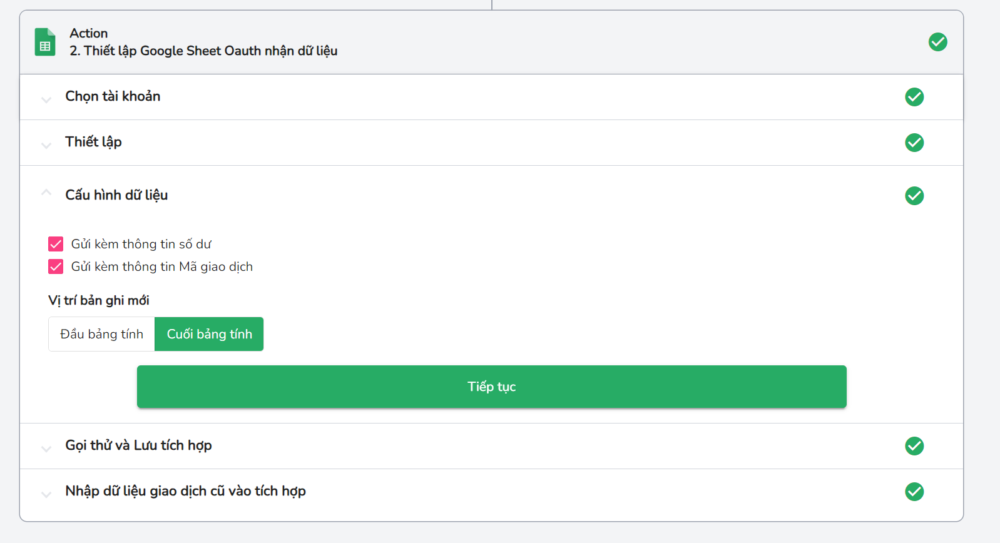

7. Tiến hành gọi thử, nếu Sheet có các cột như Mã GD, Mô tả,... là thành công
   

8. Trong Google Sheet, vào phần `Tiện ích mở rộng` -> `Apps script` để thêm scrript,

- Thay thế `Sheet_ID` bằng ID Google Sheet của bạn
- Sheet_NAME là tên sheet

```js
function doGet(request) {
  var parameters = 5;
  var sheet = SpreadsheetApp.openById('Sheet_ID').getSheetByName('Sheet_NAME');
  // Lấy tên các cột
  var headnames = sheet.getRange(1, 1, 1, parameters).getValues()[0];

  // Lấy tất cả dữ liệu từ bảng tính
  var lastRow = sheet.getLastRow();
  var range = sheet.getRange(lastRow - 1, 1, 2, parameters);
  // Lấy 2 giao dịch cuối cùng
  var values = range.getValues();

  var rows = [];
  values.forEach(function (row) {
    var newRow = {};
    headnames.forEach(function (item, index) {
      newRow[item] = row[index];
    });
    rows.push(newRow);
  });

  return ContentService.createTextOutput(
    JSON.stringify({ data: rows, error: false })
  ).setMimeType(ContentService.MimeType.JSON);
}
```

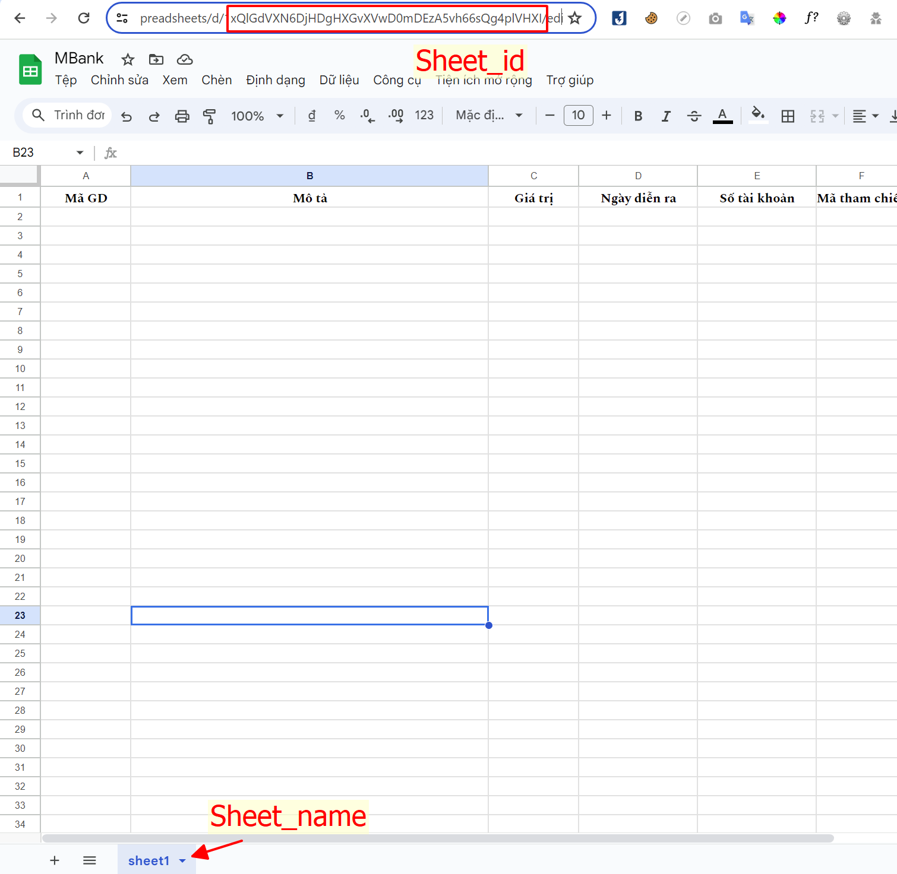

9. Sau đó nhấn triển khai -> Chọn ứng dụng web -> Tùy chọn triển khai mới -> Điền thông tin và chọn Quyền truy cập là: Bất kỳ ai
   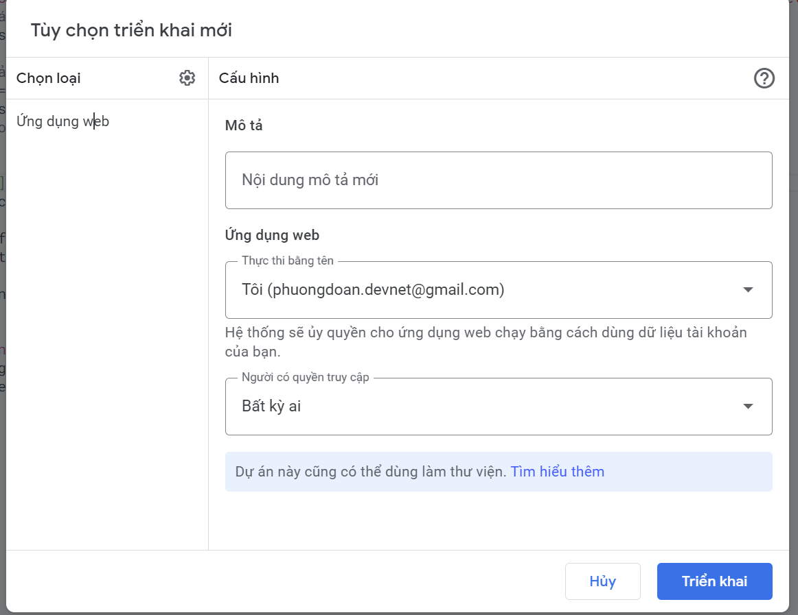

10. Sau khi triển khai, ta được đoạn script, khi mở ra có dạng tương tự:
    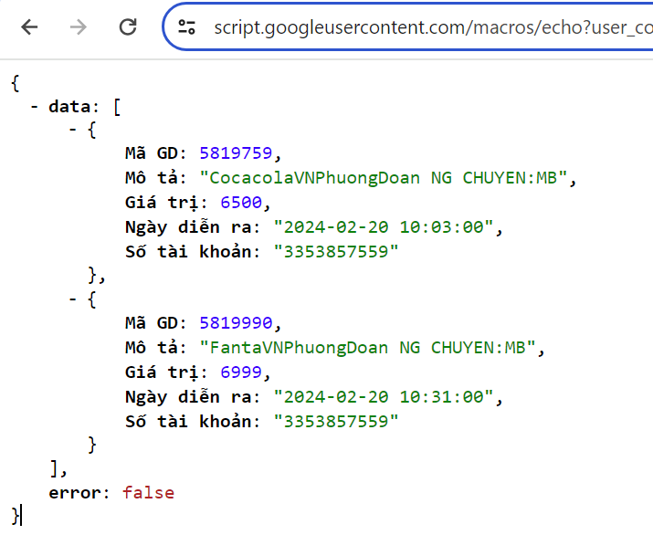

## Tiến hành xử lý ở phía website

Viết hàm lấy giá trị của Việc nạp tiền trên Google Sheet

```js
const getBankDepositAndPair = async () => {
  try {
    const response = await fetch('linkAppsScript');
    const result = await response.json();
    console.log(result);
  } catch (error) {
    console.log({ error });
  }
};
```

Kết quả trả về 2 lịch sử giao dịch cuối nhất, mong muốn bây giờ chỉ lấy lịch sử cuối cùng để chúng kiểm tra

```js
const lastTrans = result.data[result.data.length - 1];
```

Trường hợp sử dụng: Khi use click vào thanh toán, chúng ta sẽ liên tục gọi API cho đến khi nhận được giá trị thanh toán đã chuyển khoản

Tiến hành cập nhật lại hàm btnPayments click

```js
btnPayments.forEach((btnPay, index) => {
  const currentButton = btnPay;

  currentButton.addEventListener('click', async () => {
    const productInfo = products[index];
    const userID = 'PhuongDoan';
    const productInfoPrice = productInfo.price;
    const productInfoCode = productInfo.codeproduct;
    const QRBankLink = `https://img.vietqr.io/image/MBBank-3353857559-print.jpg?amount=${productInfoPrice}&addInfo=${productInfoCode}${userID}`;
    document.getElementById('qrcode').src = QRBankLink;

    //hanler pair
    setInterval(async () => {
      await getBankDepositAndPair();
    }, 2000);
  });
});
```

Sau đó, tiến hành so sánh giá trị giữa response API trả về và giá trị của product chúng ta đã click, ta thêm tham số vào cho function `getBankDepositAndPair` thành

```js
const getBankDepositAndPair = async (productInfoPrice, productInfoCode) => {
  try {
    const response = await fetch('linkAppsScript');
    const result = await response.json();
    const lastTrans = result.data[result.data.length - 1];

    const isPair =
      lastTrans['Giá trị'] === productInfoPrice &&
      lastTrans['Mô tả'].includes(productInfoCode);

    if (isPair) {
      alert('Đã chuyển khoản thành công');
    } else {
      console.log('Giao dịch đang chờ xử lý');
    }
  } catch (error) {
    console.log({ error });
  }
};
```

Ở phần `setInterval` thay đổi thành

```js
setInterval(async () => {
  await getBankDepositAndPair(productInfoPrice, productInfoCode);
}, 2000);
```

## Demo

---

## Cải thiện hiệu suất

1. Sau khi đã xác thực thanh toán thành công, chúng ta dừng việc gọi API đi

```js
let isSuccessDeposit = false;
const getBankDepositAndPair = async (productInfoPrice, productInfoCode) => {
  if (isSuccessDeposit) return;
  try {
    const response = await fetch('linkAppsScript');
    const result = await response.json();
    const lastTrans = result.data[result.data.length - 1];

    const isPair =
      lastTrans['Giá trị'] === productInfoPrice &&
      lastTrans['Mô tả'].includes(productInfoCode);

    if (isPair) {
      alert('Đã chuyển khoản thành công');
      isSuccessDeposit = true;
    } else {
      console.log('Giao dịch đang chờ xử lý');
    }
  } catch (error) {
    console.log({ error });
  }
};
```

2. Thêm delay `setTimeout` cho việc kiểm tra thanh toán, User có thể không phải ngay lập tức chuyển khoản cho chúng ta mà cần thêm một thời gian ngắn (20s) như đăng nhập Banking rồi mới tiến hành chuyển khoản.

```js
//hanler pair
setTimeout(() => {
  setInterval(async () => {
    await getBankDepositAndPair(productInfoPrice, productInfoCode);
  }, 2000);
}, 20000);
```

## Thanks your watching


## Any question


